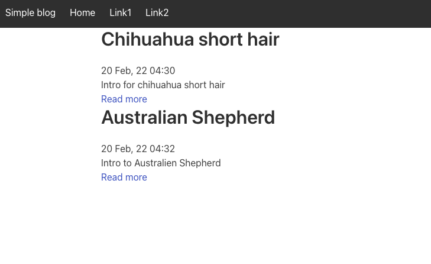
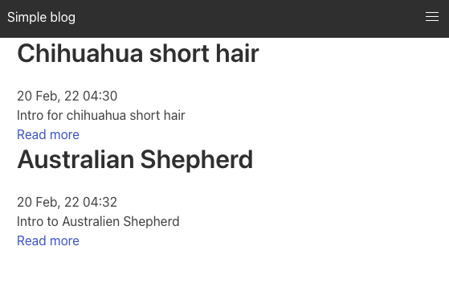

# Simple Dog Blog

Simple-dog-blog is a basic blog application in Django3, Python 3.6.10 and I used the Bulma framework for the Frontend. I deployed the application to Heroku. I kept the application basic as I wanted to test with 'collectstatic', static files. The blog has an Index page and a Detail page and you can look up posts by category. There are no static files only what comes with Bulma via cdn.

You can find the Project on Heroku [Live Demo](https://simple-dog-blog.herokuapp.com/).

## Dependencies used

- dj-database-url==0.5.0
- Django==4.0.2
- django-crispy-forms==1.14.0
- gunicorn==20.1.0
- psycopg2==2.9.3

> My next try will be with Django-Heroku and Whitenoise.

## Databases

I used the sqlite3 for development and Postgresql for Heroku.

## License
[MIT](https://choosealicense.com/licenses/mit/)